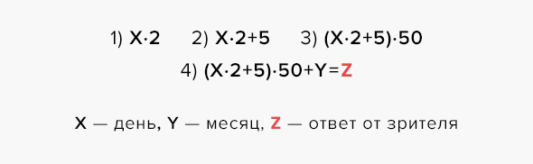

<!DOCTYPE html>
<html lang="ru">
<head>
    <meta charset="UTF-8">
    <meta name="viewport" content="width=device-width, initial-scale=1.0">
    <meta http-equiv="X-UA-Compatible" content="ie=edge">
    <title>Математические фокусы</title>
    <link rel="stylesheet" href="style.css">
</head>
<body>  
    <p-header>
        +−×÷MATH-FOCUS &nbsp; &nbsp; &nbsp; &nbsp; &nbsp; &nbsp; <fb> 5 простых математических фокусов
            &nbsp; &nbsp; &nbsp; &nbsp; &nbsp; &nbsp; &nbsp; &nbsp;  
            </fb> 
        by Ivanov DM & Knole GS                                                                                                 
    </p-header>
    <p-left>
        
    </p-left>
    <p-right>
        
    </p-right>
        

 
   
  <h1> Проектная работа по теме:</h1>
<h2>Математические фокусы</h2>
<h3>Выполнена учениками 7А класса Ивановым Дмитрием и Германом Кнолём.</h3> 

<h4>Цель работы:</h4>
    Изучение математических фокусов, их распространение в кругу одноклассников.

<ul>Задачи:</ul>
  <li>Проанализировать литературу, и материалы из Интернета.</li>
  <li>Изучить  математические фокусы.</li>

  <h4>Актуальность темы:</h4>
 Некоторые ученики считают алгебру скучной, другие считают, что алгебра имеет мало практического применения в 
  повседневной жизни, третьи вообще не имеют желания связывать свою  жизнь с математикой и поэтому считают, что им незачем её изучать. 
  Поэтому существует необходимость в повышении внимания учеников к изучению математики через её занимательные аспекты.
  Кроме того, математические фокусы редко рассматриваются и применяются в школе на уроках, да и в повседневной жизни они кажутся очень сложными.

<h4>Фокус №1</h4>

Объявите зрителям, что вы сможете угадать день рождения любого незнакомого человека, сидящего в зале. 
Вызовите любого желающего и предложите ему умножить на 2 число дня своего рождения. Затем пусть зритель сложит 
получившееся произведение и число 5 и умножит на 50 полученную сумму. К этому результату необходимо прибавить 
номер месяца рождения (июль — 7, январь — 1), вслух назвать полученное число. Через секунду вы называете день и 
месяц рождения зрителя.

В чём же секрет? Все очень просто. В уме от того числа, которое назвал зритель, отнимите 250. У вас должно выйти трехзначное или четырехзначное число. 
    Первая и вторая цифры — день рождения, две последние — месяц. Загадан день рождения. День — X, месяц — Y. Оба числа являются не более чем 
    двузначными. Зритель выполняет следующие операции:  
    
    

В уме отнимаем 250: 
    

Так как Y — не более чем двузначное число, в получившемся числе [W=X*100+Y] месяц Y и день X никак не перемешаются. Поэтому последние две цифры 
    числа W — это месяц Y, остальные — день X.
    
    Пример: 
        

        <h4>Фокус №2</h4>
        
Попросите любого из зрителей загадать число желательно однозначное, чтобы было легче выполнять операции с ним.

           
 После этого зритель должен умножить число на 2.

            
К получившимуся результату нужно прибавить 8, результат разделить на 2 и отнять задуманное число. 

    
После этого вы уверенно называете число 4

    

            

Загадано число X. Зритель выполняет следующие операции:

            
        <h4>Фокус №3</h4>
           
 Предположим, вам нужно решить пример на контрольной,  и вам нужно умножить число на 11 а считать в столбик или в уме лень?

            
Все очень просто!. например вам дан следующий пример: 23×11. Нужно просто сложить двойку и тройку 2 + 3 = 5 и пятерку вставить между 
                ними.

                
 Ответ 253. Верно ли это? Надо проверить! 3×11=33 и 20×11=220 => 220+33= 253. Все верно 

                    
    
                    <h4>Фокус №4</h4>
            
Попросите любого из зрителей загадать число желательно однозначное, чтобы было легчче выполнять операции с ним.

               
 После этого зритель должен умножить число на 2.

                
К получившимуся результату нужно прибавить 8, результат разделить на 2 и отнять задуманное число. 

        
После этого вы уверенно называете число 4

        
    
                
    
Фокус относится к случаю (1). Загадано число X. Зритель выполняет следующие операции:

                
                

                <h4>Фокус №5 </h4> 
                    
Как вы, наверное, знаете, квадрат числа — это заданное число, умноженное само на себя. Например, квадратом 7 будет 7 × 7, 
                        то есть 49. 
                        Позже мы научим  вас простому способу, который позволит без труда вычислять квадрат любого двузначного и трехзначного 
                        (и состоящего из большего количества знаков) числа.

    
                       
 Этот метод особенно легко применять, если число заканчивается на 5. Поэтому опробуем его прямо сейчас.

                        
                        
1. Ответ должен начинаться с результата умножения первой цифры возводимого в квадрат числа на цифру, большую на единицу, 
                            чем первая цифра.

                        
                       
2. Ответ заканчивается на 25.

                        
                        
Например, чтобы возвести в квадрат число 35, мы просто умножаем первую цифру (3) на 4, то есть на единицу большую цифру, 
                            после чего добавляем 25. 
                        Так как 3 × 4 = 12, следовательно, ответ — 1225. Таким образом, 35 × 35 = 1225. Проделанные шаги можно представить следующим 
                        образом:

                        
35 × 35 

                        
                            
 3 × 4 = 12

                        
                            
 5 × 5 = 25

                        
                            
Ответ: 1225

                        
                            
Как насчет возведения в квадрат числа 85? Так как 8 × 9 = 72, мы мгновенно получаем ответ: 85 × 85 = 7225.

                        
                            
Можно применить похожий прием при умножении двузначных чисел, начинающихся с одинаковых первых цифр, 
                                сумма вторых цифр которых равняется 10. Ответ будет состоять из числа, полученного с помощью вышеописанного метода (первая цифра умножается на цифру, на единицу большую), и произведения вторых цифр чисел, участвующих в умножении. 
                         Например, попробуем умножить 83 на 87. (Оба числа начинаются на 8, а сумма последних цифр 3 + 7 = 10.) 
                         Так как 8 × 9 = 72 и 3 × 7 = 21, ответ — 7221.

                        
                         
Подобным образом получаем из 84 × 86 = 7224.

                        
                            
Теперь ваша очередь. Попробуйте вычислить 52 × 24. С чего начинается ответ? С 2 × 3 = 6 . 
                                Чем заканчивается? 6 × 4 = 24. Значит, 52 × 24 = 624.

                        
                            
Помните, что использовать этот метод можно, только если первые цифры чисел одинаковы, 
                                а последние дают в сумме 10.

                       
                              
       

       <footer>

                    
Наши контакты:

                    
<a href="mailto:idenkilo-co@mail.ru">Задавайте вопросы по email.</a> 

                     - ВК Дмитрия 
                 - ВК Германа

                   
                
Особая благодарность   
                
                    интернет-изданию<a href="https://mel.fm/poleznyye_navyki/5379208-math_focus"> "Мел"</a>, АО ИД
                    <a href="https://www.spb.kp.ru/daily/52322.4/3202196">  «Комсомольская правда»</a>,
                    а также историческому интернет-изданию <a href="https://russian7.ru/post/5fokusov">"Русская Семёрка"</a> при ООО «Тура».
                

                
 С любовью ©IdenKilo&Co, 2020.
                   

                </footer> 

</body>
</html>
